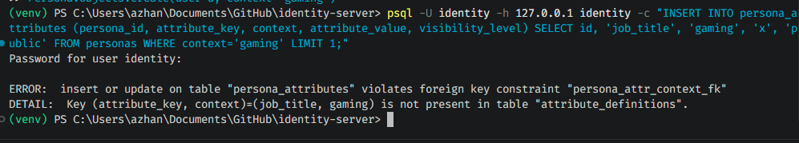
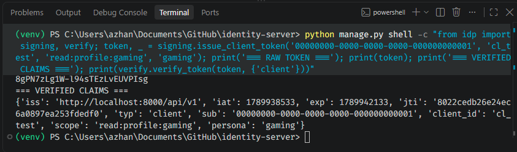
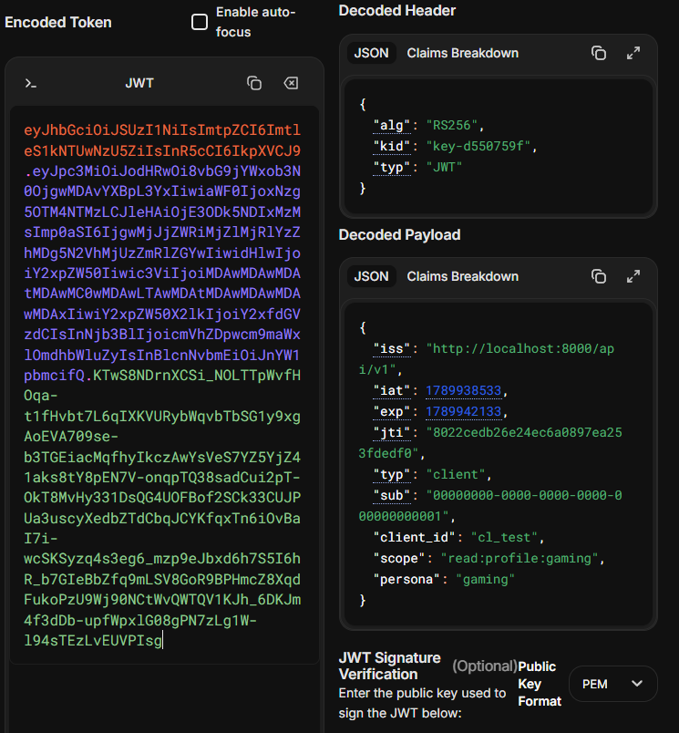
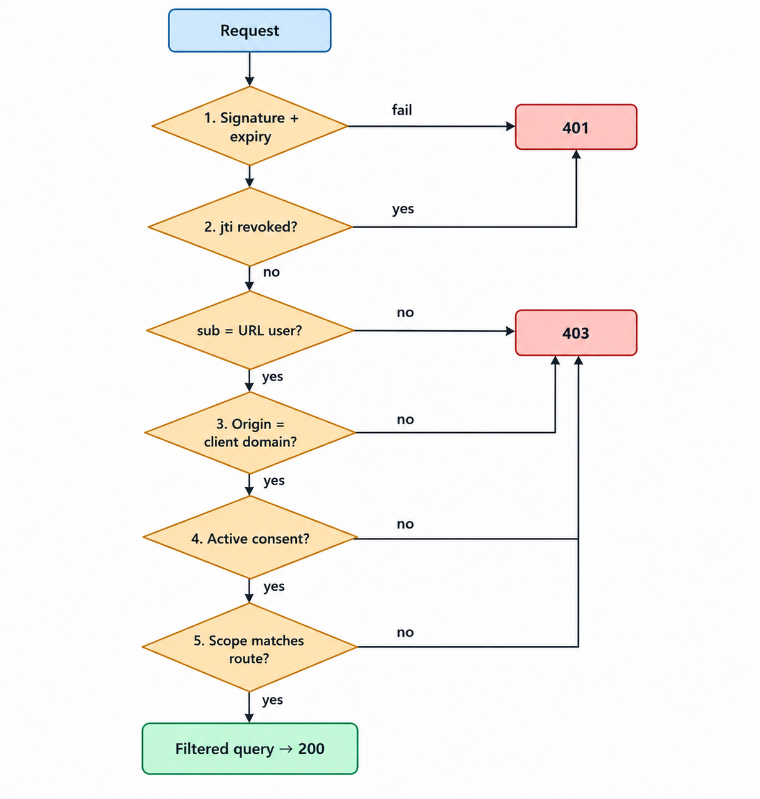
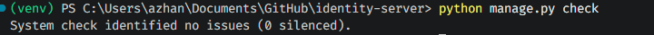
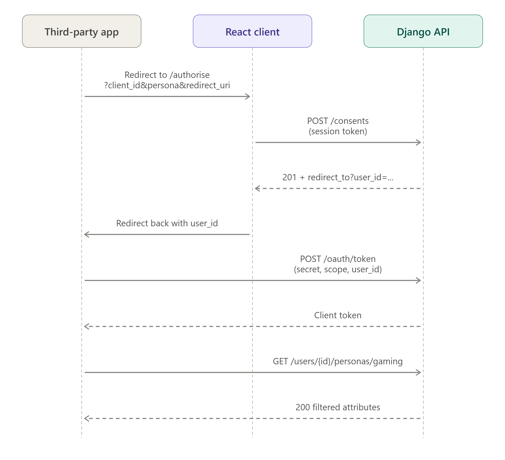
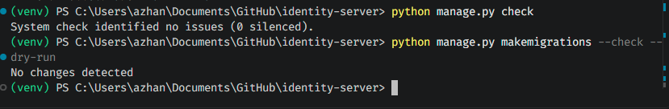
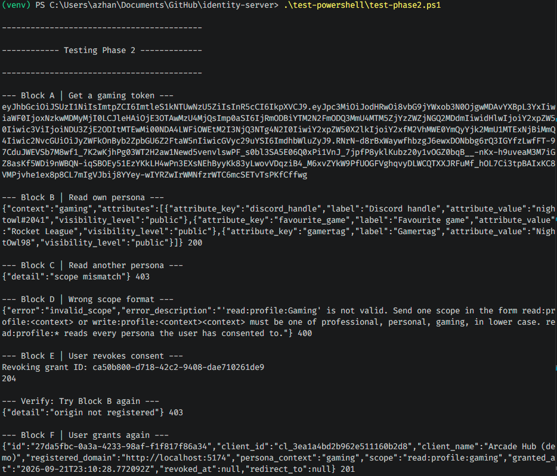
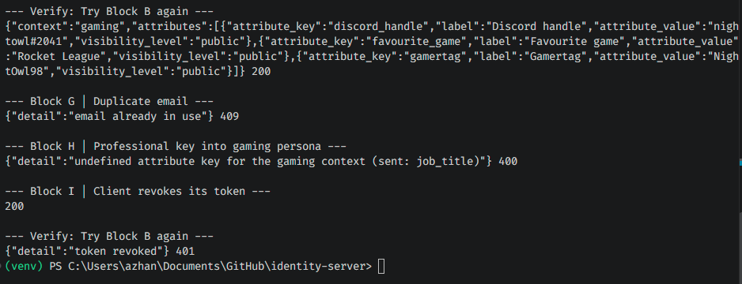
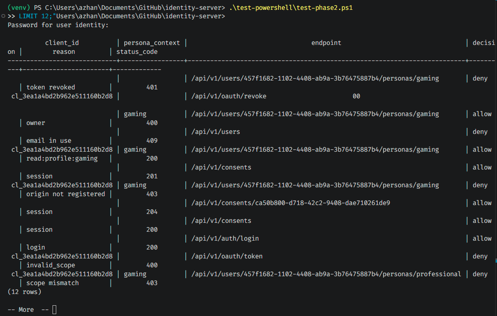

# api-gateway
Backend for final project: Identity and profile management

# Test after each Phase
## 2 Phase 1 B – Data model and the context rule

At the end of this phase all ten tables of Figure 2 exist, and PostgreSQL itself refuses a
professional key inside a gaming persona

### Test Details:

```powershell
python manage.py shell -c "from accounts.models import User; from personas.models import Persona; u=User.objects.create_user('probe@example.com','probe-password-1'); Persona.objects.create(user=u, context='gaming')"
```

```powershell
psql -U identity -h 127.0.0.1 identity -c "INSERT INTO persona_attributes (persona_id, attribute_key, context, attribute_value, visibility_level) SELECT id, 'job_title', 'gaming', 'x', 'public' FROM personas WHERE context='gaming' LIMIT 1;"
```

```powershell
python manage.py shell -c "from accounts.models import User; User.objects.filter(email='probe@example.com').delete()"
```

0002_context_fk.py 13 objects



## 3. Phase 2 – Identity module core
At the end of this phase the idp app can create an RS256 key pair, sign three token types and verify them with the public key only. The HTTP endpoints for tokens come in Section 5, after the gateway exists.

### Token types used in the system
The report describes client tokens only. A working consumer tier also needs sign-in, so the system uses three token types, told apart by a typ claim.

| typ | Issued by | Holder | Lifetime | Used for |
|---- | --------- | ------ | -------- | -------- |
| client | POST /oauth/token | Third-party app | 1 hour | Persona and names routes (steps 1–5) |
| session | POST /auth/login | "React client |  in memory" | 15 minutes | "Consent |  client registration |  owner editing" |
| refresh | "POST /auth/login |  POST /auth/refresh" | HttpOnly cookie | 7 days | Getting a new session token only |

A client token carries a user subject. RFC 6749 Client Credentials has no user [3], so the
token request adds a user_id field. The app learns the id when the user approves consent (Section 5). Knowing an id is not enough: step 4 still needs an active consent row.

### Test Details:

```powershell
python manage.py shell -c "from idp import signing, verify; token, _ = signing.issue_client_token('00000000-0000-0000-0000-000000000001', 'cl_test', 'read:profile:gaming', 'gaming'); print('=== RAW TOKEN ==='); print(token); print('=== VERIFIED CLAIMS ==='); print(verify.verify_token(token, {'client'}))"
```

Pass: the claims print, with typ, sub, client_id, scope, persona, jti, iat and exp



Paste the token into jwt.io and check the header shows "RS256" and your kid 



## 4. Phase 2 – Gateway: access decision path and audit

At the end of this phase every protected route passes through one permission class, and every API request writes one access_log row, allowed or denied.



The audit middleware writes the outcome after every branch. A session token (owner)
skips steps 3–5 after the subject check, because users do not need consent to read their
own data.

### Test Details:

```powershell
python manage.py check
```



Pass: System check identified no issues . The behaviour tests for this phase (a gaming token receives 403 on a professional route) run in Section 6, once routes exist.

## 5. Phase 2 – Resource routes

At the end of this phase all API routes are live. The table lists them;

| Method | Path | Required scope | Success | Main failure cases |
| --- | --- | --- | --- | --- |
| POST | `/api/v1/oauth/token` | Client id + secret | 200 | 400 malformed grant, 401 bad secret |
| POST | `/api/v1/oauth/revoke` | Client id + secret | 200 | 401 unknown client |
| GET | `/api/v1/.well-known/jwks.json` | None | 200 | — |
| POST | `/api/v1/auth/login` | Email + password | 200 + cookie | 401, 403 foreign origin |
| POST | `/api/v1/auth/refresh` | Refresh cookie | 200 + new cookie | 401 |
| POST | `/api/v1/auth/logout` | Refresh cookie | 204 | — |
| POST | `/api/v1/users` | None | 201 | 400 invalid payload, 409 email in use |
| GET | `/api/v1/users/{id}/personas` | `read:profile:*` or owner session | 200 | 401 bad token, 403 no consent |
| GET | `/api/v1/users/{id}/personas/{context}` | `read:profile:{context}` or owner | 200 | 401 bad token, 403 wrong scope |
| PATCH | `/api/v1/users/{id}/personas/{context}` | `write:profile:{context}` or owner | 200 | 400 undefined key, 403 wrong scope |
| GET | `/api/v1/users/{id}/names` | `read:profile:{context}`, `*` or owner | 200 | 403 |
| POST | `/api/v1/users/{id}/names` | Owner session | 201 | 400, 403 |
| DELETE | `/api/v1/users/{id}/names/{name_id}` | Owner session | 204 | 404 |
| GET | `/api/v1/attribute-definitions` | None | 200 | — |
| GET | `/api/v1/clients` | Corporate tier session | 200 | 400 unregistered domain |
| POST | `/api/v1/clients` | Corporate tier session | 201 | 400 unregistered domain |
| GET | `/api/v1/clients/{client_id}` | Corporate tier session | 200 | 404 |
| GET | `/api/v1/consents` | Consumer tier session | 200 | 401 not signed in |
| POST | `/api/v1/consents` | Consumer tier session | 201 | 400 unknown persona context |
| DELETE | `/api/v1/consents/{id}` | Consumer tier session | 204 | 403 grant belongs to another user |
| DELETE | `/api/v1/users/{id}` | Consumer tier session (account owner only) | 204 | 401 not signed in, 403 not the account owner |

### How a third-party app gets consent



Part A – Identity and account endpoints
Part B – Persona, names, client and consent routes

### Exit test – routes compile

```powershell
python manage.py check
python manage.py makemigrations --check --dry-run
```

Pass: no issues, and No changes detected . Behaviour is checked in next section



## Phase 2 – Demo data and manual API check (exit test for Phase 2)

The results shown are the real responses

Start the server and load the demo

Terminal 1:

```powershell
python manage.py runserver 8000

```

Terminal 2:

Runs the script and compare the result

```powershell
.\test-powershell\test-phase2.ps1

```

| # | What you test | Command | Expected result |
| --- | --- | --- | --- |
| 1 | Get a gaming token | see block A | JSON with `access_token` |
| 2 | Read own persona | block B | 200 and three gaming attributes |
| 3 | Read another persona | block C | 403 `{"detail":"scope mismatch"}` |
| 4 | Wrong scope format | block D | 400 `invalid_scope` with the format hint |
| 5 | User revokes consent | block E | 204 |
| 6 | Same token again | block B | 403 `{"detail":"no active consent"}` |
| 7 | User grants again | block F | 201 |
| 8 | Same token again | block B | 200 |
| 9 | Duplicate email | block G | 409 `{"detail":"email already in use"}` |
| 10 | Professional key into gaming | block H | 400 undefined attribute key for the gaming context |
| 11 | Client revokes its token | block I, then B | 200, then 401 `{"detail":"token revoked"}` |

Pass: allowed and denied requests both appear, with reasons such as scope mismatch ,no active consent and token revoked. 





### Check the audit trail

```powershell
psql -U identity -h 127.0.0.1 identity -c "SELECT client_id, persona_context, 
endpoint, decision, reason, status_code FROM access_log ORDER BY id DESC 
LIMIT 12;"

```

